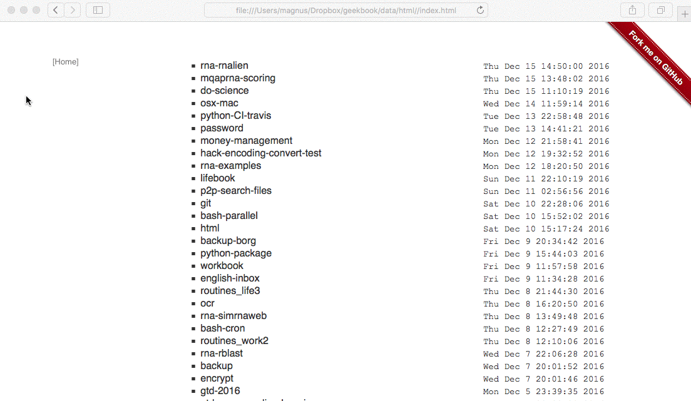

# geekbook - note taking system for nerds/geeks!

(under heavy development)

[](https://twitter.com/geekbookx)
[](http://geekbook.readthedocs.io/en/latest/?badge=latest)
[](https://travis-ci.org/mmagnus/geekbook)


  * [Features](#features)
    * [Index](#index)
    * [Dashboard](#dashboard)
    * [Extensions](#extensions)
  * [EMACS\-powered](#emacs-powered)
    * [focus\-mode](#focus-mode)
    * [list notes in Emacs (sort by Date/Name)](#list-notes-in-emacs-sort-by-datename)
    * [magit\-based diff of your notes](#magit-based-diff-of-your-notes)
  * [On your OSX](#on-your-osx)
  * [On your phone](#on-your-phone)
  * [Install & Get Started!](#install)
  * [Food for thought](#food-for-thought)
    * [Long notes vs short notes](#long-notes-vs-short-notes)



A neat way how to combine **Emacs (not requried) + Markdown Syntax + Git + Html engine** (bootstrap/python) to get the best notes-talking experience ever. Highly customizable with plugins written in Python. What's the most important, under the hood it's just a set of Markdown files.. you can do with them whatever you want, e.g. you can Pandoc (http://pandoc.org/epub.html) them to epub (that's origin of "book" part of the name).

Freatures:

- Index html based
- Sync them with Dropbox/iCloud/github
- Read from console, grep them
- Edit with almost any text editor, I'm using Emacs!
- Keep images separately, edit them in any external tool or edit them in batch
- Customize html templates
- You can sync notes in your system with notes kept at virtual machines (mounted via sshfs) or drives
- Super light!
- Pandoc markdown files to anything you want!
- Use 3rd party editors, if you wish, on your computer or on your phone.

I recommend to use **Emacs** (or VIM or other super-powerfull editor) to:

- run git on your notes in your editor,
- grep them in the editor,
- make bookmarks to parts of your notes,
- copy-paste from your notes to your programs you're writing,
- use Google Translate (https://github.com/atykhonov/google-translate)
- ispell,
- outline mode,
- focuse mode.

Sync with **Github** to have your notes (full-text searchable) with you all the time (in a private repository):


Kinda similar projects:

- www.geeknote.me

# Features
## Index


## Dashboard


## Extensions

    [tableofcontent] # give you table of content in a given place of your note
    [date] # give you date when a note was compiled

# EMACS-powered
## Focus on your notes


## List your notes in Emacs (sort by Date/Name)


## magit-based diff of your notes


[https://www.emacswiki.org/emacs/Magit](https://www.emacswiki.org/emacs/Magit)

# On your OSX

Spotlight your notes:


# On your phone
On your phone: (in this case using Dropbox & Byword on my iPhone).


Or Draft (http://lifehacker.com/draft-is-a-clean-note-taking-app-with-markdown-support-844836670) for Android (not tested by me).

# Install

To get the code:

    git clone git@github.com:mmagnus/geekbook.git
    
Requirements: 

    `pip install markdown py-gfm` # or ./install.sh
   
https://pypi.python.org/pypi/Markdown, https://pypi.python.org/pypi/py-gfm
   
to run:

    $ python app/geekbookapp.py
    root path: /Users/magnus/Dropbox
    html path: <file:///Users/magnus/Dropbox/geekbook/data/html/index.html>
    /home/magnus/Dropbox/geekbook/data/md/
    2017-01-04 21:09:25: (network.c.410) can't bind to port:  1234 Address already in use
    Could not execute http daemon lighttpd -f.
    geekbook is up... [ok]
    compiling... test.md [ok]
   
open your browser and copy-paste the ```html path``` (in my case is ```file:///Users/magnus/Dropbox/geekbook/data/html/index.html```). 

To make a new note, create a file in ```<path to your geekbook>/data/md/<notes here>```. Keep geekbookapp.py running all the time, it will detect a new note and compile it for you.

# Food for thought
## Long notes vs short notes

You can combine short notes into long ones.
