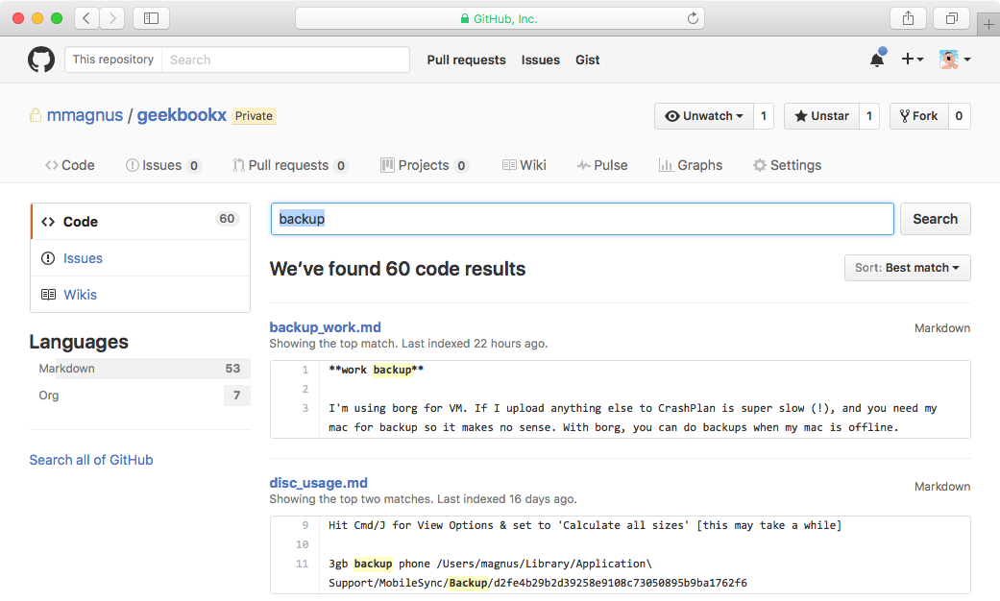
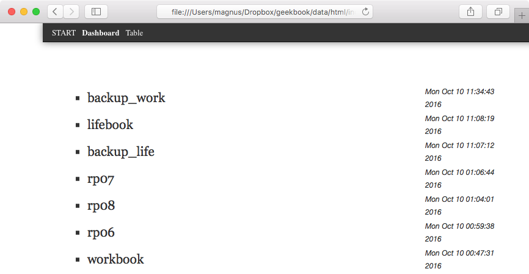
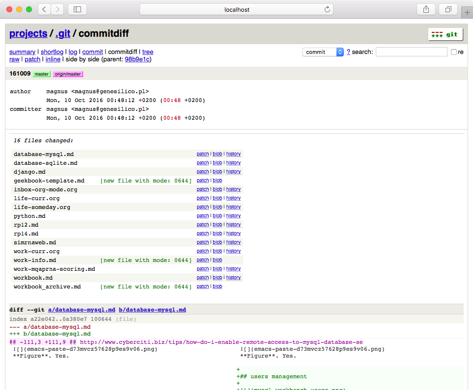
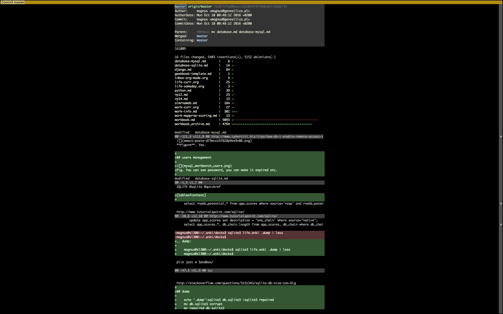
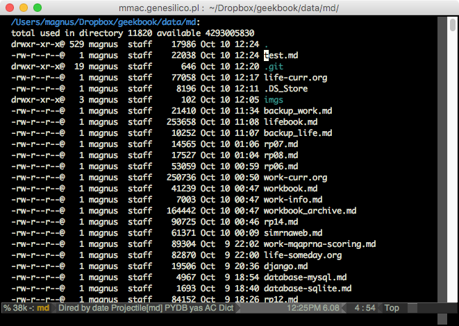
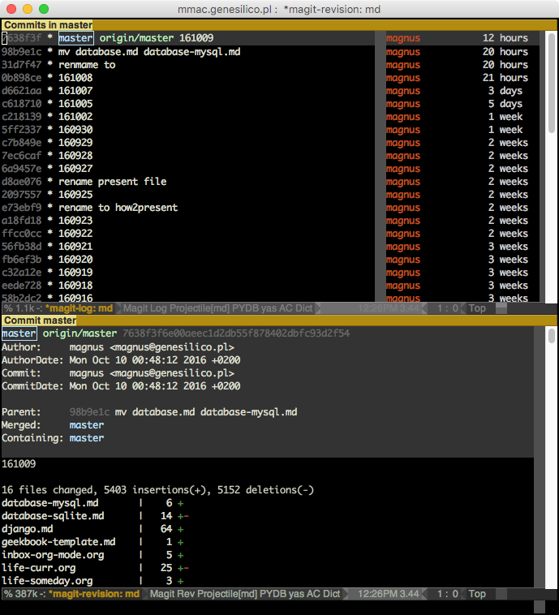
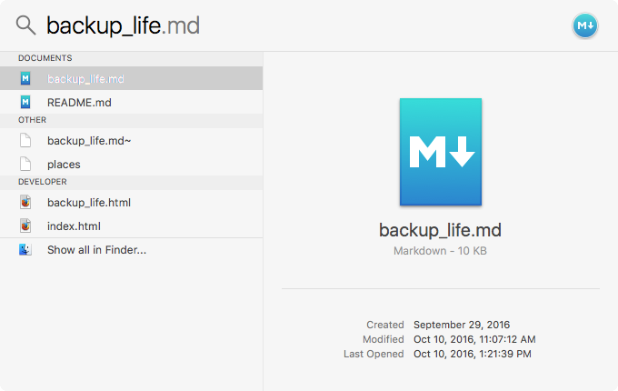
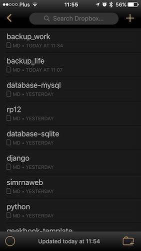
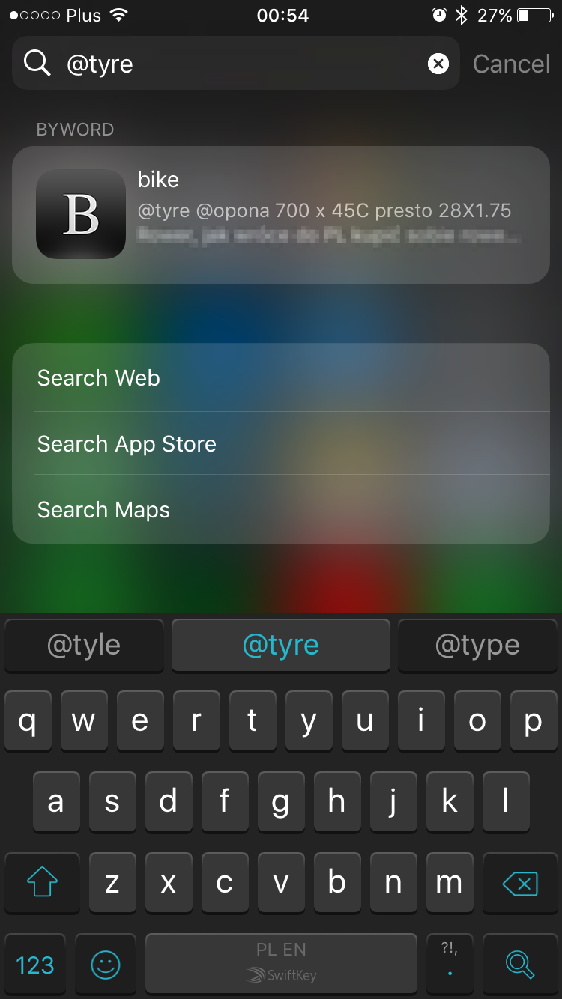

# geekbook - note taking system for nerds/geeks!

Marcin Magnus (mmagnus) & Pietro Boccaletto (akaped)

G33KB00K - fun to read & fun to write -- 🤓 eXtreme eXtendable note taking system for nerds/geeks (including scientists!) (= beautiful html generator of your markdown-based notes)  docs: http://geekbook.rtfd.io

(under heavy development)

[](https://twitter.com/geekbookx)
[](http://geekbook.readthedocs.io/en/latest/?badge=latest)
[](https://travis-ci.org/mmagnus/geekbook)

<span class="badge-paypal"><a href="https://www.paypal.me/MarcinMagnus" title="Donate to this project using Paypal"></a></span> 
<span class="badge-flattr"><a href="https://flattr.com/profile/mmagnus" title="Donate to this project using Flattr"></a></span>
<span class="badge-gratipay"><a href="https://www.gratipay.com/mmagnus" title="Donate weekly to this project using Gratipay"></a></span>


A neat way how to combine **Emacs/Atom/Sublime editor + Markdown Syntax + Git + Html engine** (bootstrap/python) to get the best notes-talking experience ever. Highly customizable with plugins written in Python. What's the most important, under the hood it's just a set of Markdown files.. you can do with them whatever you want, e.g. you can Pandoc (http://pandoc.org/epub.html) them to epub (that's origin of "book" part of the name).

Motto: **Notes are like your code**.

  * [Features](#features)
    * [Index](#index)
    * [Dashboard](#dashboard)
    * [Extensions](#extensions)
  * [EMACS\-powered](#emacs-powered)
    * [focus\-mode](#focus-mode)
    * [list notes in Emacs (sort by Date/Name)](#list-notes-in-emacs-sort-by-datename)
    * [magit\-based diff of your notes](#magit-based-diff-of-your-notes)
  * [On your OSX](#on-your-osx)
  * [On your phone](#on-your-phone)
  * [Install & Get Started!](#install)
  * [Food for thought](#food-for-thought)
  * [History](#history)

Features | Geekbook | Word Office | Apple Notes
-------- | -------- | ----------- | -----------
**Edits with Emacs** | Oh, boy, yes! | Nope. | Nope.
**Outline (collapse to headers)** | With Emacs yes. Works great! | Nope. | Nope.
**Long notes - easier to browse** | Long notes with great speed and table of contet | Very slow for long notes. Alwasy problems with formatting long notes with images. | Very good for short notes.
**Syntax highlighting** | Oh, boy, yes! | Hmm.. nope. | Hmm.. nope.
**Write your own plugins in Python** | Oh, boy, yes! | Nope. | Nope.
**Export as a pdf** | Yes | Yes | Yes
**Edit with ...** | Any text editor (with Markdown support for better UX) | Word | Apple Notes (Closed)
**Flexible** | Super flexible. You can find your own why how to make your notes | Medium | Medium
**Search** | Super easy to search with built-in search or just grep your files | More difficult to search over a set of files. Slow! | OK
**Version control** | Yes, if you use Git etc | Kind of. Hard to use (compared to Git) | Nope.
**Style customizable** | Yes, it's HTML. Do what ever you want | To some extend | Nope.
**Edit on your phone** | Yes, use Byword | Not really | Yes, works very well!
**Open & Free** | YES | Nope, closed and pricey | Close, no extra charge if you have an Apple device
**Super easy to use** | Rather for geek/nerds/hackers | Easy but who cares ;-) | Easy but who cares. ;-)

@todo Compare to Evernote.

**The preview of the default template:**

Similar projects: it's kind of like Sphinx for your documentation, or Mkdocs (http://www.mkdocs.org/).

Freatures:

- Index html based
- Sync them with Dropbox/iCloud/github
- Read from console, grep them
- Edit with almost any text editor, I'm using Emacs!
- Keep images separately, edit them in any external tool or edit them in batch
- Customize html templates
- You can sync notes in your system with notes kept at virtual machines (mounted via sshfs) or drives
- Super light!
- Pandoc markdown files to anything you want!
- Use 3rd party editors, if you wish, on your computer or on your phone.

I recommend to use **Emacs** (or VIM or other super-powerfull editor) to:

- run git on your notes in your editor,
- grep them in the editor,
- make bookmarks to parts of your notes,
- copy-paste from your notes to your programs you're writing,
- use Google Translate (https://github.com/atykhonov/google-translate)
- ispell,
- outline mode,
- focuse mode.

Sync with **Github** to have your notes (full-text searchable) with you all the time (in a private repository):



Kinda similar projects:

- www.geeknote.me

# Features
## Index



## Dashboard



## Extensions

    [tableofcontent] # give you table of content in a given place of your note
    [date] # give you date when a note was compiled
    [yt:EKyirtVHsK0] # it must be the only text in the line !!!
    
and more <http://geekbook.readthedocs.io/en/latest/edit.html#geekbook-only>.

# EMACS-powered
## Focus on your notes



## List your notes in Emacs (sort by Date/Name)



## magit-based diff of your notes



[https://www.emacswiki.org/emacs/Magit](https://www.emacswiki.org/emacs/Magit)

# On your OSX

Spotlight your notes:



# On your phone
On your phone: (in this case using Dropbox & Byword on my iPhone).



Or Draft (http://lifehacker.com/draft-is-a-clean-note-taking-app-with-markdown-support-844836670) for Android (not tested by me).



Search on your Iphone to get to the note.

# Install

See http://geekbook.readthedocs.io/en/latest/install.html

# Food for thought
 
 http://geekbook.readthedocs.io/en/latest/thoughts.html

# History

- 170705 geekbook 2.0 **flask-based geekbook**
- 170420 include_file. Open a given file and include the content of it.

        ```
        [if:/home/magnus/Dropbox/workspace/backupx/backup-peyote.sh]
        ```

- 170415 Process jupiter notebooks
- 170308 fix `RNApuzzles @done">rp01 @done` #50
- 170104 Pietro Boccaletto (akaped) joined the team!
- 161223 Add the main engine to GitHub!
- 1205XX lb_v2 was born at the conference of the Polish Bioinformatics Society
