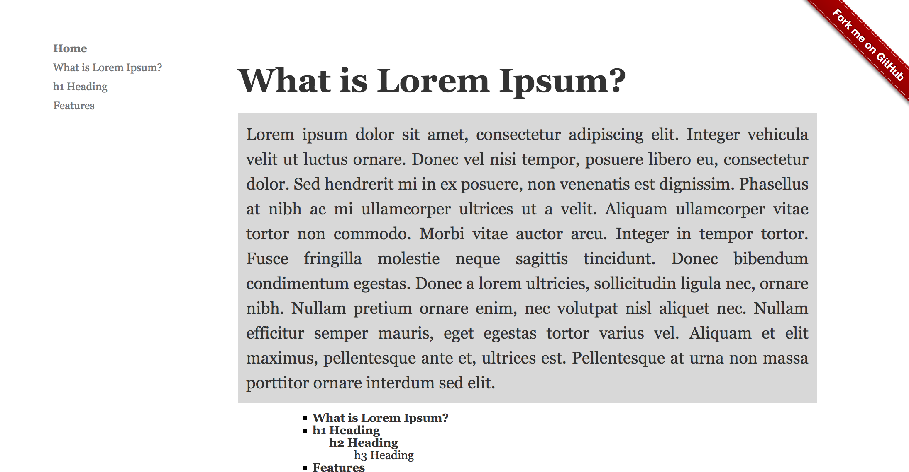

Fun to Write
==========================================

Editors (with Markdown support)
------------------------------------------

It's important to use a good editor with support of Markdown.

I'm (mmagnus) using EMACS (https://en.wikipedia.org/wiki/Emacs), sometimes I use MacDown (http://macdown.uranusjr.com/) or Atom (https://atom.io/). 

.. image:: ../imgs/emacs.png

**Fig** test.md in Emacs. I love EMACS for this Outline Mode - you can see immediately the structure of your note, it helps to navigate and *understand* (= keep it clean) your note.

.. image:: ../imgs/emacs-split-mode.png
**Fig** Emacs can "split" a note for you, so you can work in two (and more) places of your note at the same time!
	   
.. image:: ../imgs/atom.png

**Fig** test.md in Atom is OK ;-)

.. image:: ../imgs/macdown.png

**Fig** test.md in MacDown is not bad ;-)

Markdown (Github-Flavored Markdown)
------------------------------------------

Write your notes using Github-Flavored Markdown! Markdown is a way to style text on the web. You control the display of the document; formatting words as bold or italic, adding images, and creating lists are just a few of the things we can do with Markdown. Mostly, Markdown is just regular text with a few non-alphabetic characters thrown in, like # or *. 

GitHub Flavored Markdown is a version of the Markdown syntax that provides an additional set of useful features, many of which make it easier to work with your notes.

- https://guides.github.com/features/mastering-markdown/
- https://github.com/adam-p/markdown-here/wiki/Markdown-Cheatsheet

Syntax highlighting
~~~~~~~~~~~~~~~~~~~~~~~~~~~~~~~~~~~~~~~~~~~~~~~

Type::

    ``` js
    var foo = function (bar) {
      return bar++;
    };

    console.log(foo(5));
    ```

.. image:: ../imgs/syntax_hh.png

Geekbook extensions
------------------------------------------
This a set of extensions developed by the Geekbook community.

Table of Content
~~~~~~~~~~~~~~~~~~~~~~~~~~~~~~~~~~~~~~~~~~~~~~~

Type ``[tableofcontent]`` to get the table of content of a given note.

Date
~~~~~~~~~~~~~~~~~~~~~~~~~~~~~~~~~~~~~~~~~~~~~~~

Type ``[date]`` to get the current date ```2017-01-13``.

Insert Image
~~~~~~~~~~~~~~~~~~~~~~~~~~~~~~~~~~~~~~~~~~~~~~~
Type ``ii`` (and only this in a line) to ask geekbook to copy the last image from the folder when you keep you screenshots to
the folder with your images::

Before in your markdown file::

   ii

save the file, reload the file to get::

   

To turn on this plugin in your ``engine.conf_local`` set the path, e.g. ::

   SCREENSHOT_INBOX='/home/magnus/Desktop/*png' 

Abstract
~~~~~~~~~~~~~~~~~~~~~~~~~~~~~~~~~~~~~~~~~~~~~~~

Start a line with ``|`` to mark the fragment as an abstract.



Youtube
~~~~~~~~~~~~~~~~~~~~~~~~~~~~~~~~~~~~~~~~~~~~~~~

Type ```[yt:video id]```:

.. image:: ../imgs/youtube.png

Task status
~~~~~~~~~~~~~~~~~~~~~~~~~~~~~~~~~~~~~~~~~~~~~~~

Type ```@todo```, ```@done```, ```@progress``` to get:
  
.. image:: ../imgs/todo_done_progress.png
