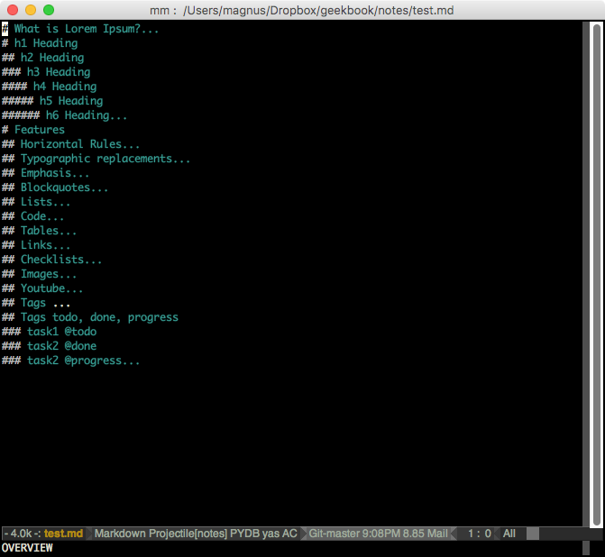
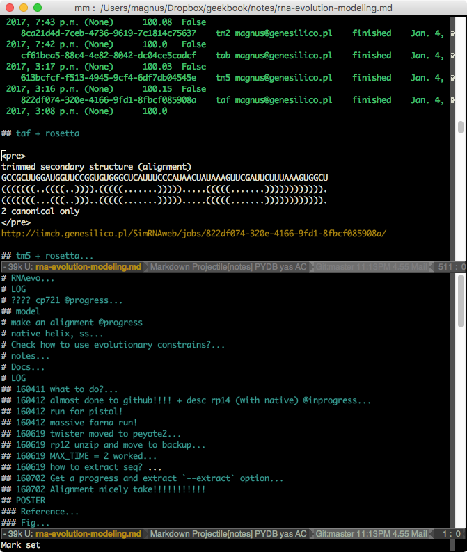
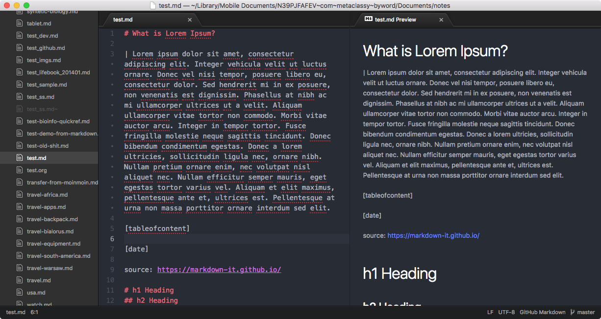
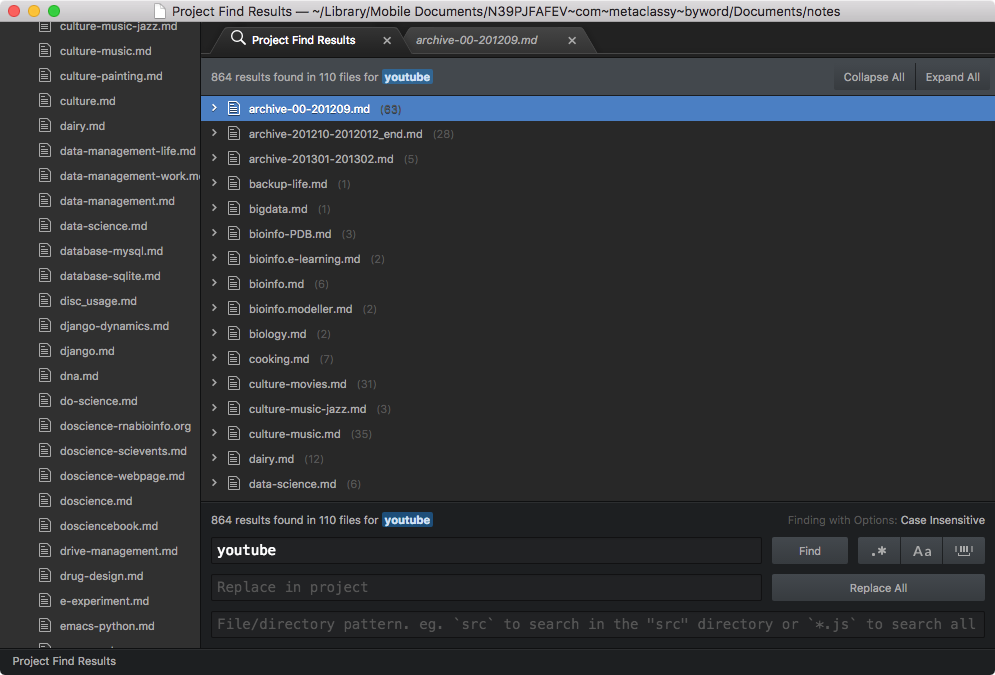
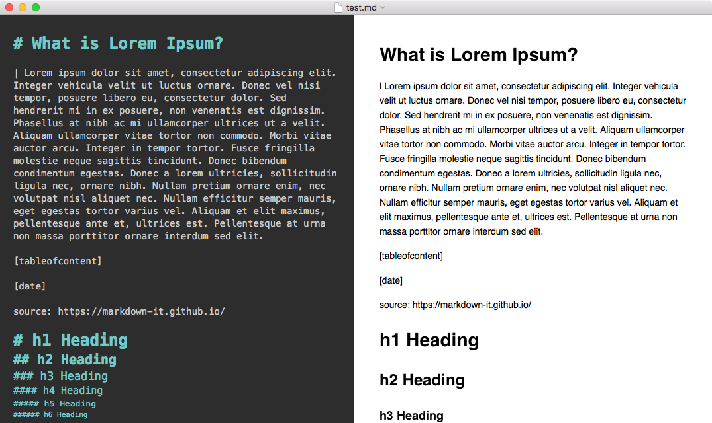
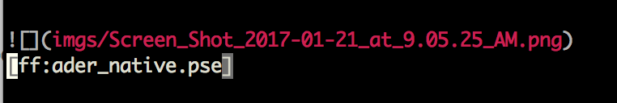
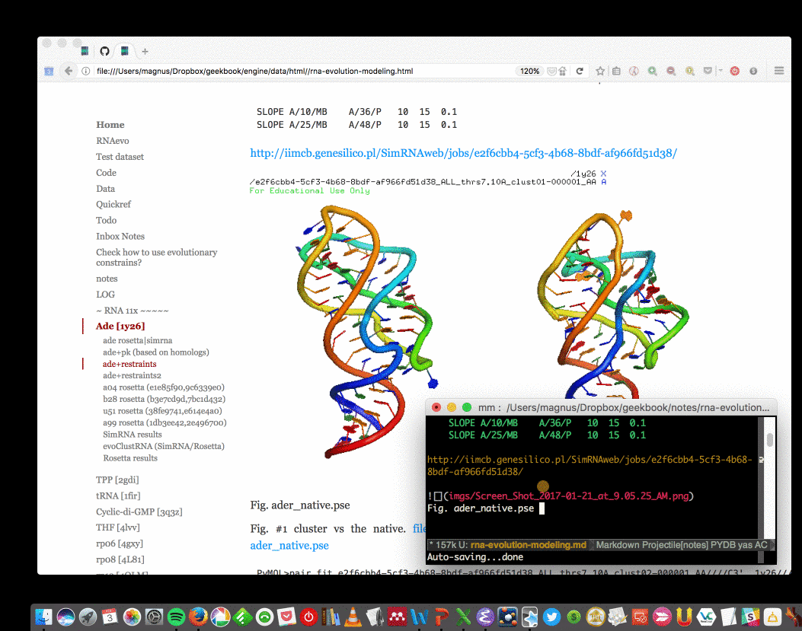
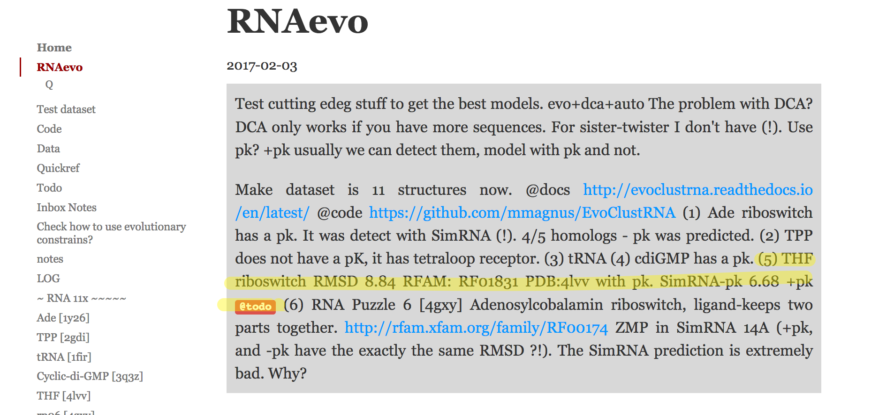
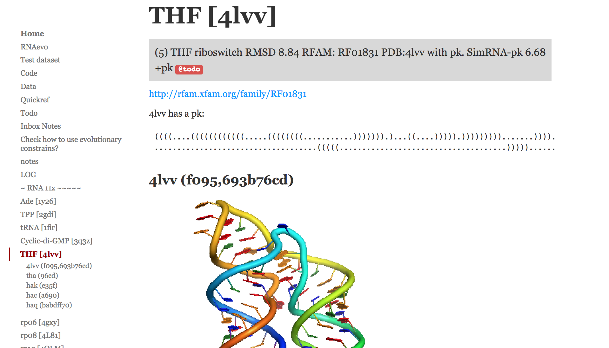
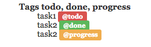

In | Write
==========================================

Editors (with Markdown support)
------------------------------------------

It's important to use a good editor with support of Markdown.

I'm (mmagnus) using EMACS (https://en.wikipedia.org/wiki/Emacs), sometimes I use MacDown (http://macdown.uranusjr.com/) or Atom (https://atom.io/). 

Emacs
~~~~~~~~~~~~~~~~~~~~~~~~~~~~~~~~~~~~~~~~~~



**Fig** test.md in Emacs. I love EMACS for this Outline Mode - you can see immediately the structure of your note, it helps to navigate and *understand* (= keep it clean) your note.


**Fig** Emacs can "split" a note for you, so you can work in two (and more) places of your note at the same time!

Atom
~~~~~~~~~~~~~~~~~~~~~~~~~~~~~~~~~~~~~~~~~~



**Fig** test.md in Atom is OK ;-)

Search in project
``````````````````````````````````````````



MacDown
~~~~~~~~~~~~~~~~~~~~~~~~~~~~~~~~~~~~~~~~~~



**Fig** test.md in MacDown is not bad ;-)

Markdown (Github-Flavored Markdown)
------------------------------------------

Write your notes using Github-Flavored Markdown! Markdown is a way to style text on the web. You control the display of the document; formatting words as bold or italic, adding images, and creating lists are just a few of the things we can do with Markdown. Mostly, Markdown is just regular text with a few non-alphabetic characters thrown in, like # or *. 

GitHub Flavored Markdown is a version of the Markdown syntax that provides an additional set of useful features, many of which make it easier to work with your notes.

- https://guides.github.com/features/mastering-markdown/
- https://github.com/adam-p/markdown-here/wiki/Markdown-Cheatsheet

Images
~~~~~~~~~~~~~~~~~~~~~~~~~~~~~~~~~~~~~~~~~~~~~~~

.. image:: ../imgs/images_left_right.png

Read more: http://stackoverflow.com/questions/14675913/how-to-change-image-size-markdown

Syntax highlighting
~~~~~~~~~~~~~~~~~~~~~~~~~~~~~~~~~~~~~~~~~~~~~~~

Type::

    ``` js
    var foo = function (bar) {
      return bar++;
    };

    console.log(foo(5));
    ```

.. image:: ../imgs/syntax_hh.png

Geekbook extensions
------------------------------------------
This a set of extensions developed by the Geekbook community.

Find Files
~~~~~~~~~~~~~~~~~~~~~~~~~~~~~~~~~~~~~~~~~~~~~~

Type ``[ff:<name_of_the_file>]`` to trigger ``locate`` (on Linux) or ``glocate`` (on macOS, install ``brew install findutils``) to find a full path to your file and insert it in the given place in a generated html.

.. warning:: You have to keep you locate database up to date, use ``sudo updatedb`` (on Linux) or ``sudo glocate`` regularly.

Example:



to get this:



Table of Content
~~~~~~~~~~~~~~~~~~~~~~~~~~~~~~~~~~~~~~~~~~~~~~~

Type ``[tableofcontent]`` to get the table of content of a given note.

Date
~~~~~~~~~~~~~~~~~~~~~~~~~~~~~~~~~~~~~~~~~~~~~~~

Type ``[date]`` to get the current date ```2017-01-13``.

Insert Image
~~~~~~~~~~~~~~~~~~~~~~~~~~~~~~~~~~~~~~~~~~~~~~~
Type ``ii`` (and only this in a line) to ask geekbook to copy the last image from the folder when you keep you screenshots to
the folder with your images::

Before in your markdown file::

   ii

save the file, reload the file to get::

   

To turn on this plugin in your ``engine.conf_local`` set the path, e.g. ::

   SCREENSHOT_INBOX='/home/magnus/Desktop/*png' 
   
   
Insert Image from DropBox link
~~~~~~~~~~~~~~~~~~~~~~~~~~~~~~~~~~~~~~~~~~~~~~~
If you use a Mac and you like to store your images in Dropbox this is the function for you! 
I (akaped) use it to take screenshot with my mac, dropbox will automatically take the screenshot, copy it in a synced screenshot folder and return you a link ( in your clipboard !). 

What do you need to do now ? 
Just paste the link in your text editor, save the file, and whatch it change ! 

ex. Dropbx link ``` https://www.dropbox.com/s/1yu4r8aosqwky4r/Screenshot%202017-01-20%2023.49.26.png?dl=0 ```
Paste - Save > geekbook returns pure wonderful markdown ``````. This will be then processes in html to appear as smooth as possible in your geeky notes.

DANGER! : This function changes your markdown file! You need a good text editor like emacs or Atom to detect this change in your code and avoid a possible crash. 

Abstract
~~~~~~~~~~~~~~~~~~~~~~~~~~~~~~~~~~~~~~~~~~~~~~~

Start a line with ```! ```(mind the space after !) to mark the fragment as an abstract.

You can collect all lines marked as an abstract, use tag ``[abstract]``::

   ! ble ble ble
   [abstract]
   # task
   ! summary of task

it will give you::

  Ble Ble ble
  Summary of task.



The last sentence is collected along a note.


   
Youtube
~~~~~~~~~~~~~~~~~~~~~~~~~~~~~~~~~~~~~~~~~~~~~~~
Make you notes look more fun! You can insert a youtube video by typing  ```[yt:video id]```:
Where video_id corresponds to the 11 alphaumeric characters that you can see in the youtube url of your video. 
Ex. dj kitty -- url -- https://www.youtube.com/watch?v=ICDGkVbSWUo its video_id = ICDGkVbSWUo
Type in geekbook ```[yt:ICDGkVbSWUo]``` to visualise one of our favourite Djs. 


Task status
~~~~~~~~~~~~~~~~~~~~~~~~~~~~~~~~~~~~~~~~~~~~~~~
It's fun to take notes and to take track of our projects ? Isn't it ?
Now you can type these useful tags in your notes to know what was done, what are you doing and what to do !

Type ```@todo```, ```@done```, ```@progress``` to get:
  


How do we use this ? We like to introduce this tag in our titles to follow our progresses.
```## 19.02.2017 - Go to buy the milk for Dj kitten @done```
