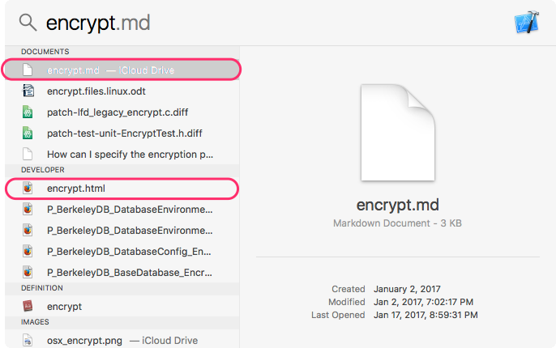
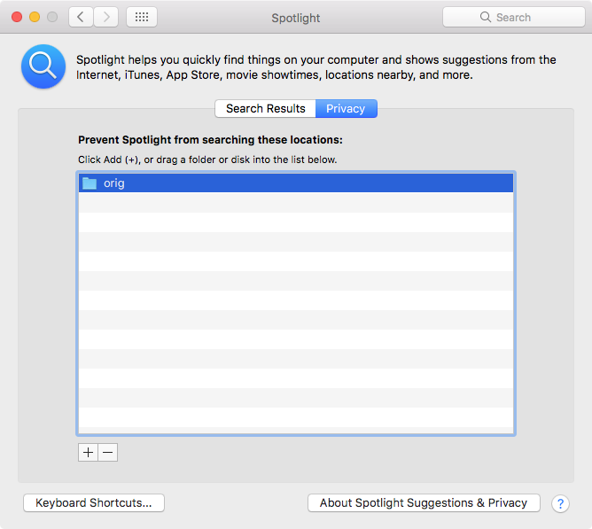

Miscellaneous
=================================================================

Geekbook on Mac
-----------------------------------------------------------------

Spotlight
~~~~~~~~~~~~~~~~~~~~~~~~~~~~~~~~~~~~~~~~~~~~~~~~~~~~~~~~~~~~~~~~~

Before using Spotlight you tell Spotlight to stop indexing folder ``geekbook/engine/data/orig``. Thus some technical copies used by Geekbook internally of your notes will not be index by Spotlight.

Read more: http://osxdaily.com/2011/12/30/exclude-drives-or-folders-from-spotlight-index-mac-os-x/ 

How to backup your notes?
-----------------------------------------------------------------

Dropbox
~~~~~~~~~~~~~~~~~~~~~~~~~~~~~~~~~~~~~~~~~~~~~~~~~~~~~~~~~~~~~~~~~

You can keep your notes under Dropbox etc.

Git (GitHub)
~~~~~~~~~~~~~~~~~~~~~~~~~~~~~~~~~~~~~~~~~~~~~~~~~~~~~~~~~~~~~~~~~

If you want to backup your notes, we recommend to use git :-)
and keep your notes as you keep you source code and commit changes
and push it to your *private* (so no one can read it ) repository. For private repositories you can use GitHub but you have to pay.

.. image:: ../imgs/geekbookx.png

You can how your notes always online!

Borg (to a remote machine or external drive)
~~~~~~~~~~~~~~~~~~~~~~~~~~~~~~~~~~~~~~~~~~~~~~~~~~~~~~~~~~~~~~~~~
You can use Borg. Borg (BorgBackup) is a deduplicating backup program. Optionally, it supports compression and authenticated encryption.

Use something like this::
  
   export BORG_PASSPHRASE='<you secret password>'
   export BORG_REPO="malibu:~/notes" # where malibu is a remove machine
   
   borg init malibu:~/notes
   
   borg create -v --stats  malibu:~/notes::{now} ~/geekbook/notes
   # remove your old backups notes 
   borg prune --list -v $BORG_REPO --keep-daily=7 --keep-weekly=4 --keep-monthly=6

make a bash script and add it to your crontab::

   @hourly ~/bin/notes-backup.sh

Borg is way more complex than this. Read please Borg_.

.. _Borg: http://borgbackup.readthedocs.io/en/stable/usage.html

