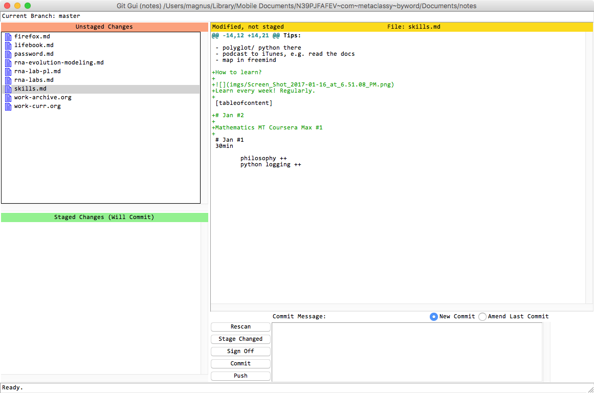

Food for thoughts
=================================================================

Long notes vs short notes
-----------------------------------------------------------------
It seems that if it make sense try to make long notes. One project should be a long note. You have everything in one place, and you can just scroll up or down and use the table of content sidebar to get where you want, it's a really time saver! Not having to click and go to a different note, it's really fun and help you focus on your work. That's why Word doc files don't work for me, it's to hard to find yourself easily and for very big files, Word is just super slow!

Git/Github your notes
-----------------------------------------------------------------
We develop a plugin to automatically git your notes. The script can be added to your crontab. 

``geekbook/plugins/ContentAutoCommit/git-auto-commit.sh``

Magnus: I realized that I prefer to commit changes of my notes by myself. I usually improve some new information, fix some notes etc. So I developed the script but I'm not really using it right now.

Images (external)
-----------------------------------------------------------------
It's also very useful in some applications to have images seperate than your notes. You can have dynamics notes, where your images are in varous places and you provide in Markdown links to them. You can also grab any image to Gimp, edit it and just save. The image in the note will be updated then. You can edit images in batch.

Styles
-----------------------------------------------------------------
Geekbook compared to Word is very easy to stylish however you want :-) It's just HTML. You can do whatevery you want using CSS etc.

Version control of your notes
-----------------------------------------------------------------
If you use git, you can keep all version of your notes, you can track the whole history, in the similar way how you can deal with your code.

Super-flexible
-----------------------------------------------------------------
This system is super flexible. You can use whatever editor you like, you can edit your notes on your phone, one a cluster using Vi/Nano/etc. It's text file so you will be able to open it alwasy in the future.
