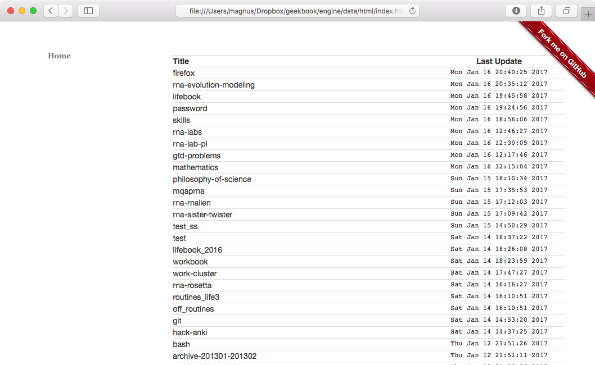
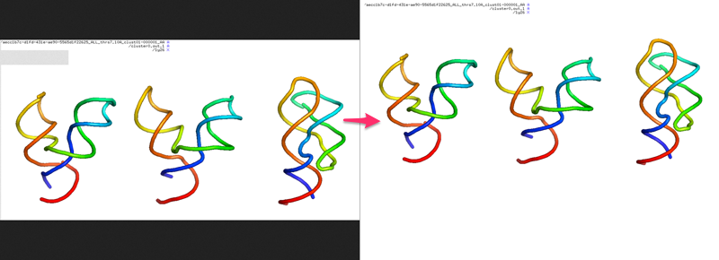

Fun to Read
==============================================================

**Fig**. The index in Safari.

Of course you can browser your notes in any browser. I'm using (mmagnus) Firefox with following addons to improve the experience.

Auto-reload
--------------------------------------------------------------

To force your browser to refresh HTML files whenever there is a change on you drive (when geekbook compiles something new) please use something like this Auto-load (https://addons.mozilla.org/en-US/firefox/addon/auto-reload/?src=api)

Old default image style
--------------------------------------------------------------

To get "old default image style" (white background) in Firefox install this add-on (https://addons.mozilla.org/en-US/firefox/addon/old-default-image-style/)

