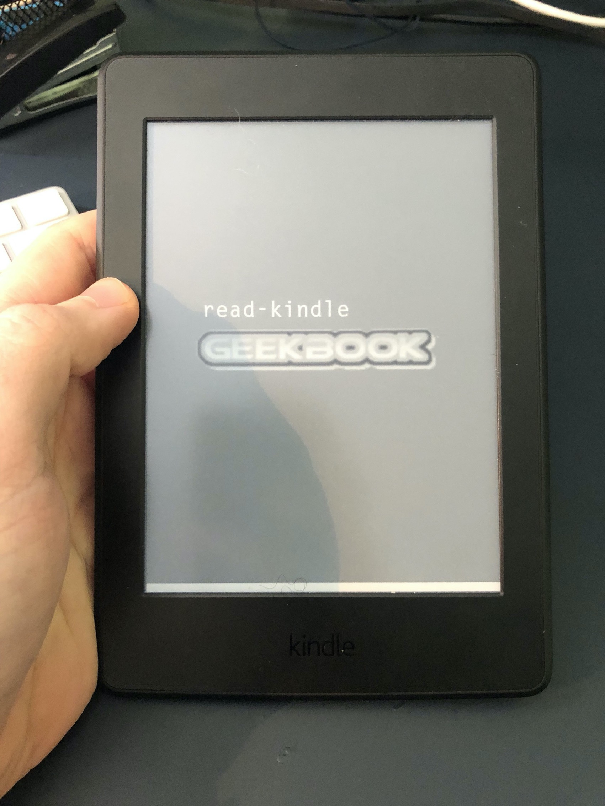
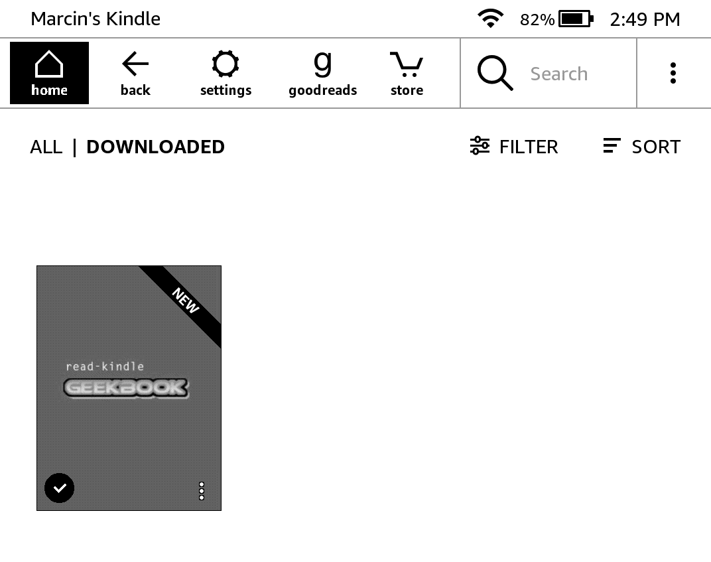
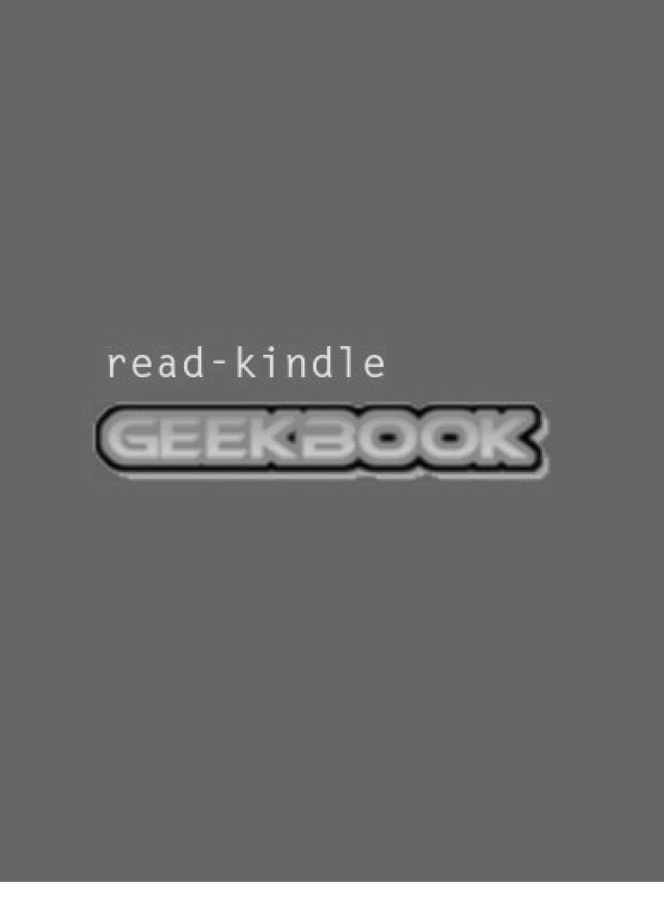
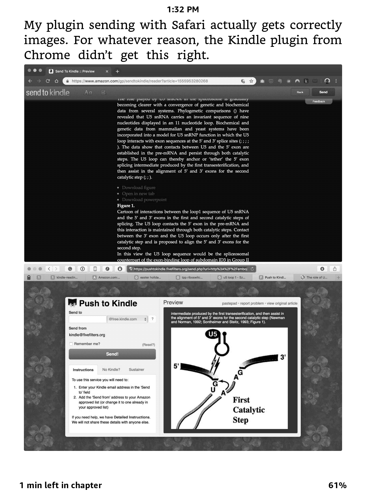
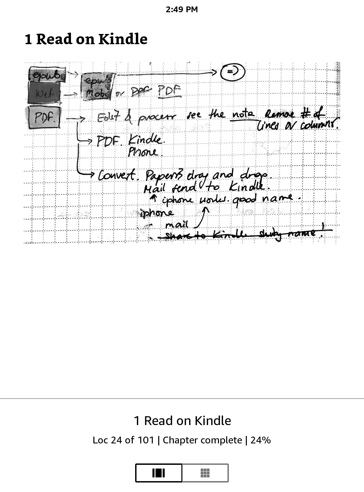
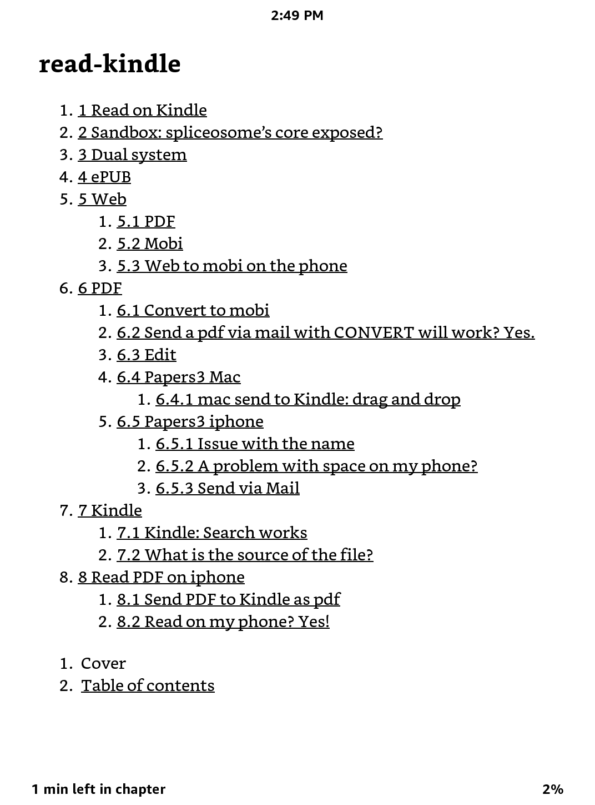
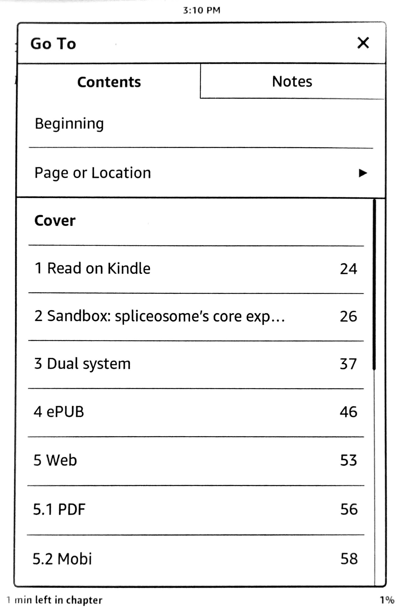
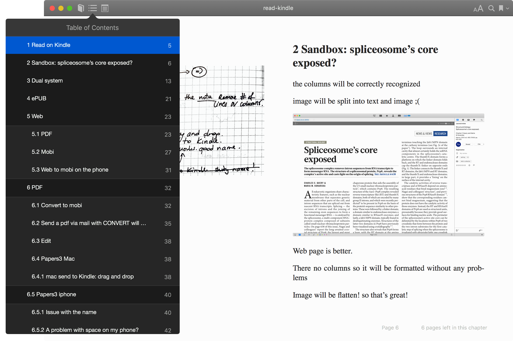
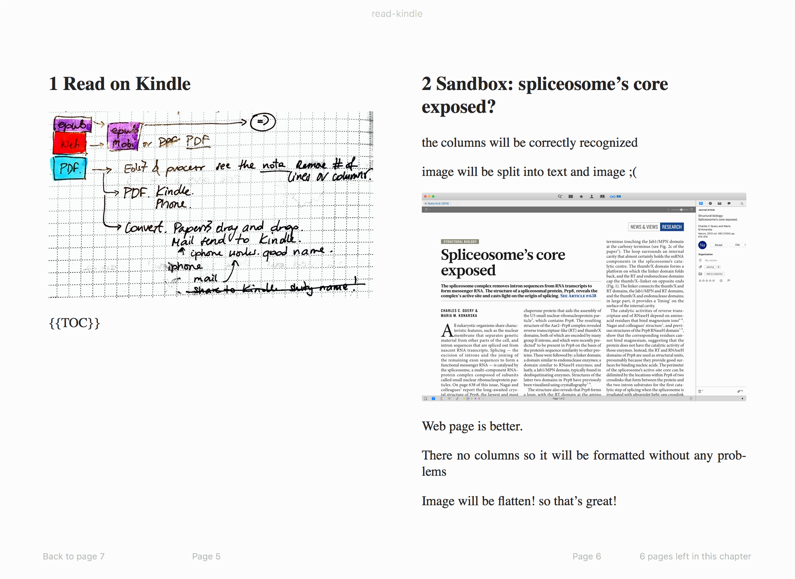
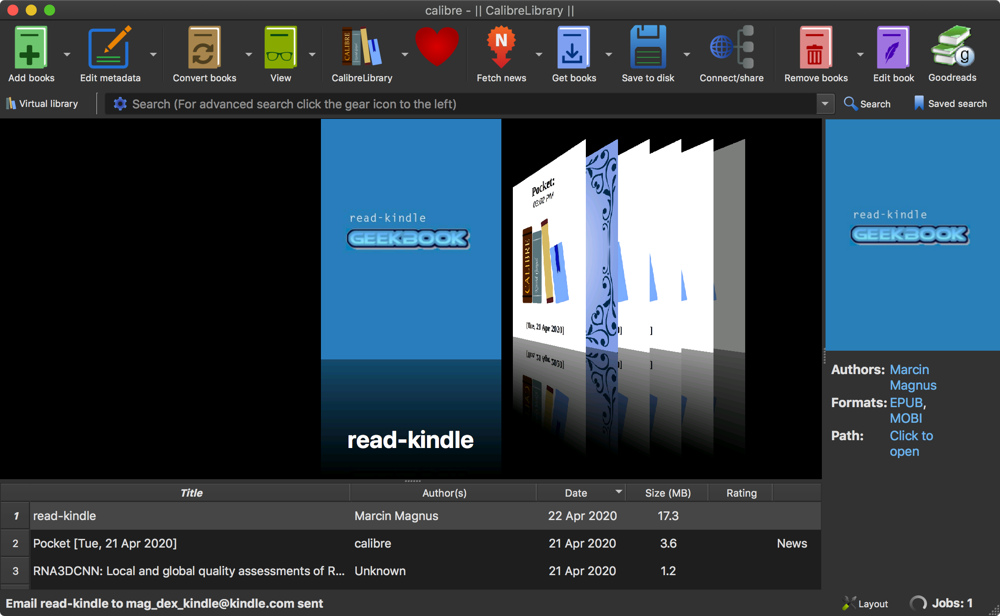

# Geekbook Bookify

This script uses `pandoc` [1] to convert your Markdown notes into ebooks and send them to whatever e-reader you use, in my case Kindle. I just finished a pretty cool and very simple program to take your Geekbook notes, give them a nice cover (with the added title of your note on that cover), that you can send to your e-book. I love it :-)

    ./geekbook-bookify.py ../../notes/read-kindle.md

[1] <https://pandoc.org>

# Kindle

The book in the Browser.

-------------------------------------------------------------------------------

A wonderful, customed cover!

-------------------------------------------------------------------------------

Images of course work!

-------------------------------------------------------------------------------

I often scan images into my notes.

-------------------------------------------------------------------------------

The books has a great TOC.

-------------------------------------------------------------------------------

The books has a great TOC. (2)
# Apple Books

# Calibre
I use it to send the book to my Kindle.

